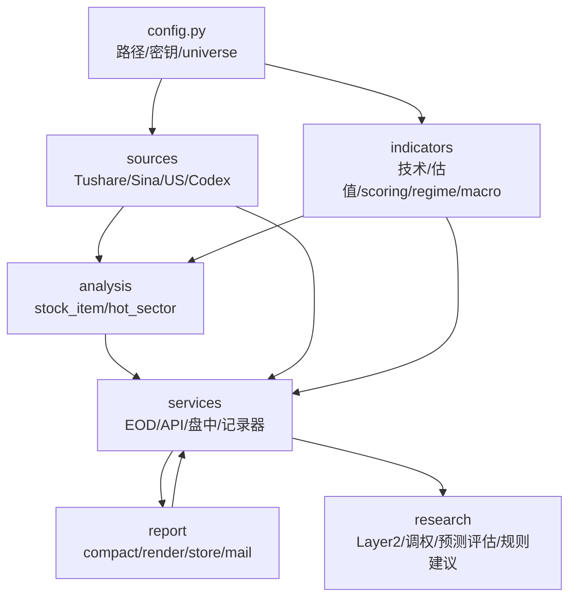
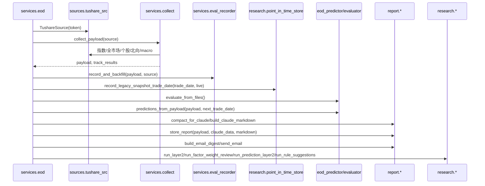
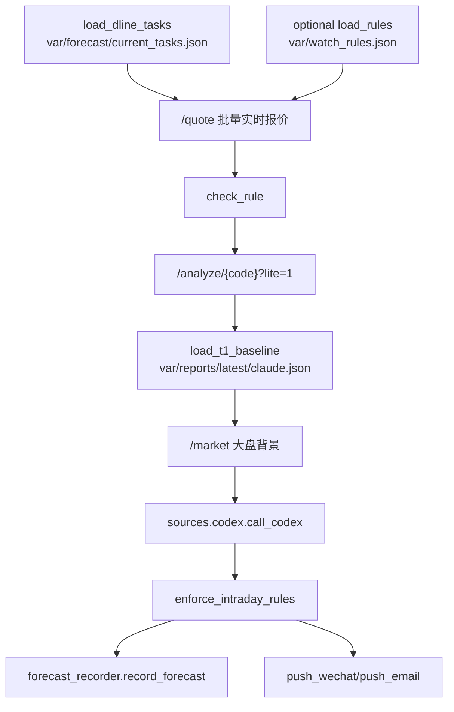

# 代码架构总览

本文档按当前真实代码整理, 作为后续 MR7 文档同步和盘中数据层施工前的代码地图。

核对范围:

- `src/vaxstock/**`
- `manage.py`
- `deploy/*.service` / `deploy/*.timer`
- 当前 `var/` 落盘数据与各目录 README

不包含 `script/stock_report_enhanced.py` 的重构建议。该巨石文件仍按项目铁律保持不动。

## 总体分层

当前目标架构仍是单向分层:

```text
config
  -> sources
  -> indicators
  -> analysis
  -> report
  -> services
  -> research
```

实际代码中 `services` 是运行入口和编排层, 会组合 `sources/indicators/analysis/report/research`。`research` 包含显式调用的 point-in-time 存储/回放和离线评估；它不触网、不在 import 时写盘，也不反向修改生产规则。



## 包职责

| 包/文件 | 当前职责 | 关键约束 |
|---|---|---|
| `vaxstock.config` | 统一路径、密钥加载、watchlist/holdings 加载 | import 可读本地配置和创建 `var/` 目录, 不触网, 不初始化外部 client |
| `vaxstock.util` | 通用转换/格式化工具 | 只放跨层通用小工具 |
| `vaxstock.sources` | 数据源层: Tushare、Sina、US market、Codex HTTP、市场指数/全市场统计 | 只取数和适配字段, 不做策略决策 |
| `vaxstock.indicators` | 计算层: 技术指标、估值分位、右侧评分、market regime、macro 7 维 | 尽量纯函数, 缺数据标待验证, 不造默认中性值 |
| `vaxstock.analysis` | 单票/板块分析装配 | `stock_item.build_stock_item` 显式接收 `market_regime`, 不读全局 regime |
| `vaxstock.tracks` | 赛道纵切, 当前有 AI 赛道 | `tracks.contract` 是叶子契约, `tracks.__init__` 不 re-export 重依赖实现 |
| `vaxstock.report` | 报告压缩、Markdown、邮件、落盘、推送 | `store_report` 是报告三件套落盘 SSOT, 不取数 |
| `vaxstock.services` | 运行入口和状态写入编排 | EOD/API/盘中/预测/核验/池管理都在这里 |
| `vaxstock.research` | point-in-time 契约/存储/回放与离线评估 | 存储写入必须显式调用；评估不自动调参，不反向覆盖历史 |

## 主要入口

| 入口 | 命令/服务 | 作用 |
|---|---|---|
| EOD 全流程 | `python -m vaxstock.services.eod` / `vaxstock-eod.service` + timer | 盘后/次日 05:00 生成 EOD 报告、Eval、Prediction、离线评估 |
| FastAPI | `python -m vaxstock.services.api` / `stock-api.service` | `/health`、`/quote`、`/market`、`/analyze/{code}`、watch/pool 管理 |
| 盘中盯盘 | `python -m vaxstock.services.intraday` / `intraday-watch.service` | 轮询规则, 触发 lite 快照 + T-1 基准 + Codex 研判 + forecast 冻结 |
| 观察池 CLI | `python manage.py ...` | SSH 本地维护 watchlist/focus/concepts, 复用 `services.pool_admin` |
| 离线研究 | `vaxstock.research.*.run_*` | 读取 JSONL 生成 Layer2/调权/规则建议报告 |

## EOD 运行链路

代码入口: `src/vaxstock/services/eod.py::run_eod`



关键点:

- `TushareSource` 在 `run_eod` 内显式初始化。
- 报告交易日以 `payload["market_overview"]["trade_date"]` 为准, 不是机器自然日。
- `record_and_backfill` 先回填历史结果, 再记录当日快照。
- legacy 快照写完后并行规范化到 Research v2；旧 B 线继续供现有读取方使用。
- EOD Prediction 先核验旧预测, 再用本次 EOD 定稿 payload 生成下一交易日 live prediction。
- 离线研究报告失败只 warning, 不阻断 EOD 报告三件套落盘。

## EOD 采集链路

代码入口: `src/vaxstock/services/collect.py::collect_payload`

主要步骤:

1. `sources.market.get_index_quotes` 取指数。
2. `sources.market.get_market_overview` 取全市场涨跌/涨跌停统计。
3. `indicators.regime.detect_market_regime` 计算 `market_regime`。
4. `_collect_north_flow` 取北向资金, 用 `market_overview.trade_date` 判断是否当日。
5. `indicators.macro.MacroIndicator(source).summary()` 生成 macro。
6. `config.load_holdings/load_watchlist` 读取 universe。
7. `analysis.stock_item.build_stock_item` 逐票装配指标和评分。
8. `sources.us_market.fetch_us_market_data` + `tracks.ai.AITrack.evaluate` 生成美股参考和 AI 赛道。

注意:

- 东财相关路径已诚实降级为 `available=False`。
- `build_stock_item` 的 `market_regime` 是显式入参。
- `tracks.contract` 是 DTO 契约, 不应被 `tracks.__init__` 污染。

## FastAPI 链路

代码入口: `src/vaxstock/services/api.py`

主要端点:

| 端点 | 作用 |
|---|---|
| `/health` | 返回服务状态、Tushare 积分、当前 regime 缓存 |
| `/quote?codes=...` | 批量 Sina 实时报价, 供盘中盯盘轮询 |
| `/market` | 返回当前 regime 和 overview, 盘中只消费此单一大盘背景源 |
| `/analyze/{code}?lite=1` | 盘中轻量快照, 价量和均线位置, 不生成右侧评分/资金结论 |
| `/analyze/{code}` | 完整单票分析 |
| `/watch/*` | 盯盘规则 API |
| `/pool/*` | 观察池管理 API |

盘中铁律相关:

- `lite=1` 必须走轻量路径, 避免冷缓存时先扫全市场。
- 盘中研判引用 T-1 EOD 基准可以, 不允许盘中新生成评分、买卖价指令或资金臆测。

## 盘中盯盘链路

代码入口: `src/vaxstock/services/intraday.py::run`



当前盘中数据层状态:

- 已有 D 线盘中消费者: `services.intraday` 读取 `current_tasks.json` 执行 trigger DSL,触发后冻结 `var/forecast/forecasts.jsonl`。
- 已有 D 线 EOD 观察任务生成器: `services.forecast_planner`, 输出 `var/forecast/observation_tasks.jsonl` 与 `current_tasks.json`。
- 每条 D 线 observation task 保存给 Codex 的 `evidence_pack(A/B/C/D_contract)`。
- 每条 forecast 保存 `T-1 baseline + lite_snapshot + regime + structured verdict`。
- 目前尚未有独立 forecast result 回填文件。
- C2d 待办包括盘中演变记忆、主动盘面体检、`/intraday/ask` 咨询端点。


## Company Context Schema

`services.company_context` defines the non-scoring `E_context` schema used by C-line and D-line:

- C-line `services.eod_predictor` freezes it as `context_ref` in each prediction row.
- D-line `services.forecast_planner` injects it as `evidence_pack.E_context` for Codex planning.
- Real A-line EOD sources currently connected: `tushare.fina_indicator` -> `earnings.latest_report`, `tushare.forecast` -> `company_events` guidance, `tushare.express` -> `company_events` earnings.
- Missing future disclosure calendar / full announcement / news source data is represented as `source_status=pending_source` or `concept_tags_only`; no default neutral value is created.
- Current deterministic scoring and rule versions do not use this context for factor weights.
## 状态写入模块

| 模块 | 写入位置 | 写入性质 |
|---|---|---|
| `report.store.store_report` | `var/reports/<YYYY-MM-DD>/payload.json` / `claude.json` / `claude.md` | 同交易日可覆盖, 报告产物 |
| `services.eval_recorder.record_snapshots` | `var/eval/factor_snapshots.jsonl` | append-only, 同 `(trade_date, code)` 幂等跳过 |
| `services.eval_recorder.backfill` | `var/eval/factor_results.jsonl` | append-only, 默认机械记录连续日 horizon, 同 key 多行按 horizon 合并读取 |
| `research.point_in_time_store` | `var/research/observations.jsonl` + `factor_values/YYYYMMDD.jsonl` + `run_manifests.jsonl` | append-only；版本冲突报错；manifest 最后提交 |
| `services.regime_auditor.record_regime_audit` | `var/eval/regime_audit.jsonl` + md | JSONL 幂等, md 可重生成 |
| `services.eod_predictor.record_predictions` | `var/prediction/eod_predictions.jsonl` | append-only, `prediction_id` 幂等 |
| `services.prediction_evaluator.record_prediction_results` | `var/prediction/eod_prediction_results.jsonl` | append-only, `(prediction_id, horizon)` 幂等 |
| `services.forecast_planner.record_observation_tasks` | `var/forecast/observation_tasks.jsonl` + `current_tasks.json` | observation_tasks append-only; current 可物化覆盖 |
| `services.forecast_recorder.record_forecast` | `var/forecast/forecasts.jsonl` | append-only, 每次盘中触发一行 |
| `services.pool_admin` | `script/config/watchlist.json` + `var/pool_audit.jsonl` | watchlist 覆盖写, audit append-only |

## 离线研究层

| 模块 | 读取 | 输出 |
|---|---|---|
| `research.layer2_eval` | `factor_snapshots.jsonl` + merged `factor_results.jsonl` | `var/eval/layer2_report_<trade_date>.md` |
| `research.factor_weight_review` | `factor_snapshots.jsonl` + merged `factor_results.jsonl` | `var/eval/factor_weight_review_<trade_date>.md` |
| `research.prediction_eval` | `eod_predictions.jsonl` + `eod_prediction_results.jsonl` | `var/prediction/prediction_layer2_report_<trade_date>.md` |
| `research.rule_suggester` | Prediction join 后结果 | `var/prediction/rule_suggestions_<trade_date>.md` |
| `research.legacy_snapshot_replay` | legacy `factor_snapshots.jsonl` | 幂等迁移/回放到 Research v2，不修改源文件 |

研究层原则:

- 不自动修改 `scoring.py`。
- 不回写历史 prediction 原文。
- 样本数只展示 `N`, 不因为样本薄就隐藏统计。

## 盘中数据层下一步边界

当前代码按用户最新术语区分四条线:

- A 线: `var/reports` EOD 原始地基数据。
- B 线: `var/eval` EOD 因子快照 + 连续日真实结果回填。
- C 线: `var/prediction` 基于 EOD 定稿数据的 T 日动作预测与核验。
- D 线: `var/forecast` 盘中观察任务、触发评价与后续结果回填。

D 线已经具备 EOD 观察任务生成器;下一步不应把 D 线样本混入 B 线全样本。建议继续补齐:

1. D 线结果如何在 EOD 后核验的文件位置和 horizon 定义。
2. 盘中演变记忆如何记录连续触发/未触发过程。
3. `/intraday/ask` 是否只读 A/B/C/D 已冻结 evidence、T-1 基准、lite 快照和已冻结 forecast。
4. 主动盘面体检的输入来源, 以及哪些字段必须标记为盘中未定稿。

