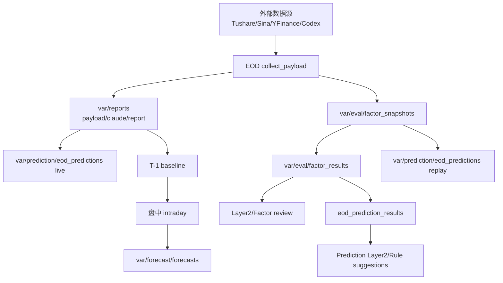

# 数据架构与落盘总览

本文档按当前真实落盘数据整理, 用来说明每条数据线从哪里来、什么时候写、能回答什么问题、是否可以覆盖。

核对时间: 2026-07-03 工作区当前文件。

## 总体数据分层



核心原则:

- 交易日锚定用真实数据里的 `trade_date`, 不是 `now()`。
- 原始事实源优先看 JSON/JSONL, markdown 报告是可重生成的解读层。
- 预测原文一旦写入不因未来结果修改。
- 结果回填单独写结果文件。
- append-only 文件读取时要按各自 key 合并, 不能简单最后一行覆盖。

## 当前库存快照

### EOD 报告

| report dir | payload trade_date | stocks | market_regime |
|---|---:|---:|---|
| `2026-06-25` | `20260625` | 40 | `momentum` |
| `2026-06-26` | `20260626` | 42 | `momentum` |
| `2026-06-29` | `20260629` | 42 | `panic` |
| `2026-06-30` | `20260630` | 42 | `panic` |
| `2026-07-01` | `20260701` | 42 | `value` |
| `2026-07-02` | `20260702` | 42 | `value` |

### JSONL 行数

| 文件 | 当前行数 | 日期覆盖 |
|---|---:|---|
| `var/eval/factor_snapshots.jsonl` | 250 | `20260625` 到 `20260702` |
| `var/eval/factor_results.jsonl` | 372 | `20260625` 到 `20260701` |
| `var/eval/regime_audit.jsonl` | 6 | `20260625` 到 `20260702` |
| `var/prediction/eod_predictions.jsonl` | 250 | target `20260626` 到 `20260703` |
| `var/prediction/eod_prediction_results.jsonl` | 208 | target `20260626` 到 `20260702` |
| `var/forecast/forecasts.jsonl` | 7 | `2026-06-26` 到 `2026-07-03` |

当前数据质量扫描:

- 上述 JSONL 均可解析, 坏行数为 0。
- `factor_snapshots.jsonl` 无重复 `(trade_date, code)`。
- `factor_results.jsonl` 未发现 `complete=True` 但 `ret/mkt_ret/excess` 不齐的旧污染行。
- `eod_predictions.jsonl` 无重复 `prediction_id`。
- `eod_prediction_results.jsonl` 无孤儿结果, 均能对上 prediction。
- 42 条 `target_trade_date=20260703` 的 live prediction 仍 pending, 因为目标日结果尚未回填到本地文件。

## 报告层: `var/reports`

每个交易日一个目录:

```text
var/reports/<YYYY-MM-DD>/
  payload.json
  claude.json
  claude.md
```

| 文件 | 来源 | 作用 | 写入性质 |
|---|---|---|---|
| `payload.json` | `services.collect.collect_payload` -> `report.store.store_report` | EOD 全量事实源, 排查字段优先看它 | 同交易日覆盖 |
| `claude.json` | `report.claude_md.compact_for_claude` + EOD 注入 `prediction_summary` | 压缩结构化数据, 盘中 T-1 baseline 主要读这里 | 同交易日覆盖 |
| `claude.md` | `report.claude_md.build_claude_markdown` | 人读完整报告, 邮件附件 | 同交易日覆盖 |

关键字段:

| 字段 | 含义 |
|---|---|
| `payload.generated_at` | 程序运行时间, 不是交易日依据 |
| `payload.market_overview.trade_date` | 报告交易日 SSOT |
| `payload.market_regime` | `momentum/value/panic` |
| `payload.stocks[]` | holdings + watchlist 全量个股 |
| `payload.tracks[]` | 赛道纵切结果, 当前主要是 AI 赛道 |
| `claude_data.prediction_summary` | target 日 EOD Prediction 核验摘要 |

## Eval B 线: `var/eval`

B 线是无偏全截面样本线。它每天记录 holdings + watchlist 全 universe, 用来回答:

```text
某天所有用户 universe 股票的冻结因子是什么?
这些因子在后续每个已发生交易日(T+1/T+2/T+3...)的真实收益和超额如何?策略/报告层再选择性抽取 T+1/T+3/T+5/T+10/T+20/T+30。
```

### `factor_snapshots.jsonl`

来源: `services.eval_recorder.record_snapshots`

写入时点: EOD 流程中, 回填旧结果之后记录当日快照。

写入规则:

- append-only。
- 同 `(trade_date, code)` 已存在则跳过。
- `trade_date` 取 `payload.market_overview.trade_date`。

核心字段:

| 字段 | 含义 |
|---|---|
| `snapshot_ts` | 写入时刻 |
| `trade_date` | 因子冻结交易日 |
| `code/name/group/concepts` | 股票身份与分组 |
| `price_at_snapshot` | 后续收益计算基准价 |
| `metrics` | 技术、估值、资金、右侧评分等冻结因子 |
| `market` | 当时世界状态, 包含 regime、breadth、north_flow、macro、AI 赛道 |

### `factor_results.jsonl`

来源: `services.eval_recorder.backfill`

写入时点: 每次 EOD 开头回填历史 snapshot 的可用 horizon。

写入规则:

- append-only。
- 同 `(trade_date, code)` 可能多行, 因为 T+1/T+2/T+3... 每个交易日 horizon 是逐步成熟的。
- 读取必须按 horizon merge;策略层只抽取自己关心的 horizon,不能让基础数据截断。
- 只有 `ret/mkt_ret/excess` 对目标 horizon 都齐, 才能视为完整。

核心字段:

| 字段 | 含义 |
|---|---|
| `ret` | 个股未来收益, 如 `{"1": 0.02}` |
| `mkt_ret` | 基准指数未来收益 |
| `excess` | `ret - mkt_ret` |
| `complete` | 仅显式 finite horizons 回填时表示目标 horizon 是否齐备;默认连续日路径没有固定完成态 |
| `filled_ts` | 结果写入时刻 |

当前 horizon 覆盖(本地现有文件来自旧 sparse 跑次;新逻辑会继续 append 补齐已成熟的连续日 horizon):

| 基准日 | 当前可用 horizon |
|---|---|
| `20260625` | `T+1/T+3/T+5` |
| `20260626` | `T+1/T+3` |
| `20260629` | `T+1/T+3` |
| `20260630` | `T+1` |
| `20260701` | `T+1` |
| `20260702` | 尚未有结果行 |

### Eval 报告

| 文件 | 来源 | 作用 | 写入性质 |
|---|---|---|---|
| `layer2_report_<trade_date>.md` | `research.layer2_eval.run_layer2` | 按 score 档和 `regime|macro` 看未来收益/超额 | 可重生成覆盖 |
| `factor_weight_review_<trade_date>.md` | `research.factor_weight_review.run_factor_weight_review` | 按因子高低桶复盘, 给人工调权证据 | 可重生成覆盖 |
| `regime_audit.jsonl` | `services.regime_auditor.record_regime_audit` | 每日 regime 判定证据 | append/idempotent |
| `regime_audit_<trade_date>.md` | `services.regime_auditor.record_regime_audit` | 单日 regime 审计说明 | 可重生成覆盖 |

## EOD Prediction 线: `var/prediction`

Prediction 线验证的是:

```text
当时系统根据 EOD 定稿数据给出的 action/direction/confidence 后来是否正确?
```

它不是单纯验证 `right_side_score` 档位收益。score 档收益在 `var/eval`。

### `eod_predictions.jsonl`

来源:

- replay: `services.eod_predictor.bootstrap_*`
- live: `services.eod_predictor.predictions_from_payload` + `record_predictions`

写入规则:

- append-only。
- `prediction_id = baseline_trade_date + target_trade_date + code + rule_version + generation_mode`。
- 同 `prediction_id` 已存在则跳过。
- `generation_mode=replay/live` 必须分开。

当前库存:

- 208 条 replay。
- 42 条 live。
- target `20260703` 的 42 条 live 尚 pending。

核心字段:

| 字段 | 含义 |
|---|---|
| `baseline_trade_date` | 预测依据的 EOD 定稿日 |
| `target_trade_date` | 要预测/核验的交易日 |
| `features_ref` | 当时使用的特征引用 |
| `features_ref.right_side_score` | 冻结评分 |
| `features_ref.market_regime` | 当时 market regime |
| `prediction.action` | 动作标签, 如 `avoid/watch/candidate_buy/panic_rebound_watch` |
| `prediction.direction` | `up/down/neutral` |
| `prediction.confidence` | 规则先验置信度, 不是统计胜率 |
| `prediction.expected_excess_bucket` | 对超额方向的预期 |
| `rule_version` | 规则版本, 规则升级只能前滚 bump |

### `eod_prediction_results.jsonl`

来源: `services.prediction_evaluator.evaluate_from_files`

输入:

- `var/prediction/eod_predictions.jsonl`
- `var/eval/factor_results.jsonl`

写入规则:

- append-only。
- 同 `(prediction_id, horizon)` 已存在则跳过。
- 每次 EOD 归并全部历史预测与 B 线结果，补齐每条预测从 T+1 到当前已成熟 T+N 的连续交易日路径，不以 T+30 截断。
- 缺真实 `ret` 时不写假结果；`mkt_ret/excess` 缺失时保留为 `null`，不阻断股票自身绝对收益核验。
- 只有预测原始 horizon 计入正式命中；后续路径标记为 `post_prediction_path`。用户策略读取按每个 T+N 独立复核，不把不同 horizon 混成一个命中率。

核心字段:

| 字段 | 含义 |
|---|---|
| `actual.trade_date` | 该 horizon 对应的真实交易日 |
| `actual.ret` | 个股真实收益 |
| `actual.mkt_ret` | 基准收益 |
| `actual.excess` | 超额收益 |
| `evaluation.evaluation_role` | 原始预测核验或后续路径证据 |
| `evaluation.direction_hit` | 方向是否命中 |
| `evaluation.positive_excess` | 是否正超额 |
| `evaluation.action_hit` | 旧版超额收益动作命中，仅保留为研究参考 |
| `evaluation.deviation` | 旧版超额收益偏离类型 |
| `evaluation.absolute_action_expectation` | `positive/non_positive/unscored`，由冻结 action/direction 确定 |
| `evaluation.absolute_action_hit` | 原始 horizon 上，动作是否符合股票自身收益正负 |
| `evaluation.path_absolute_action_alignment` | 后续 T+N 路径是否仍符合原动作预期 |
| `evaluation.absolute_deviation` | 绝对收益口径的偏离类型 |

### Prediction 报告

| 文件 | 来源 | 作用 | 写入性质 |
|---|---|---|---|
| `prediction_layer2_report_<trade_date>.md` | `research.prediction_eval.run_prediction_layer2` | 按 action/direction/confidence/market/concept 分桶 | 可重生成覆盖 |
| `rule_suggestions_<trade_date>.md` | `research.rule_suggester.run_rule_suggestions` | 给人工规则升级建议 | 可重生成覆盖 |

## D 线: `var/forecast`

D 线是盘中预测告警/观察层。它不是全 universe 样本,而是用 A/B/C 已冻结证据生成次日观察任务,盘中触发后形成客观评价,最终反哺 C线。

```text
A-line EOD raw foundation
B-line EOD factor snapshots + daily real-return backfill
C-line EOD Prediction
  -> D-line EOD job enqueue (current_job)
  -> D-line async worker generates observation tasks
  -> D-line intraday trigger evaluation
  -> full-session coverage finalization
  -> trigger-path 15m/30m/close finalization
  -> forecast_results T+N backfill
  -> trigger-vs-qualified-no-trigger review
```

### `observation_jobs.jsonl` / `current_job.json`

Source: `services.forecast_planner.enqueue_observation_job`

Write timing:

- During EOD, after C-line live predictions and report payload are written.
- It only queues a local job. It does not call Codex and must not block report/email delivery.

Purpose:

- `observation_jobs.jsonl` is append-only job history.
- `current_job.json` points to the latest job consumed by `vaxstock-dline-plan.service`.

### `observation_tasks.jsonl`

Source: `services.forecast_planner.record_observation_tasks`

Write timing:

- After `vaxstock-dline-plan.service` consumes `current_job.json`.
- Codex receives the A/B/C evidence pack and returns next-session observation tasks.
- D-line candidates are not the full watchlist. They are holdings from `holdings.json` plus active candidates from `task_pool.json`.

Write rules:

- append-only.
- `task_id = baseline_trade_date + target_trade_date + code + plan_version`.
- Non-JSON LLM output, non-whitelisted trigger fields, or plans without valid triggers are skipped.

Core fields:

| Field | Meaning |
|---|---|
| `task_id` | Stable task id |
| `baseline_trade_date` | EOD trade date used as evidence baseline |
| `target_trade_date` | Intraday session to observe |
| `source` | Currently `codex_llm` |
| `plan_version` | D-line observation plan version |
| `evidence_pack.A_eod` | A-line EOD evidence |
| `evidence_pack.B_factor_history` | Recent B-line factor result summary |
| `evidence_pack.C_prediction` | C-line action/direction/confidence |
| `evidence_pack.D_contract` | Allowed trigger fields/operators/types and forbidden outputs |
| `observation.trigger_blueprints` | Mechanically executable trigger DSL |
| `observation.c_line_feedback_focus` | What this task should feed back to C-line |

### `current_tasks.json`

Source: `services.forecast_planner.record_observation_tasks`

Purpose: materialized active tasks for the target session. It is not append-only and can be rebuilt from `observation_tasks.jsonl`.

### `current_observation_status.json`

Source: `services.observation_coverage.record_task_observation`, called by `services.intraday` after a same-session quote is verified.

Purpose: runtime evidence for each current D-line task. Writes are atomic and duplicate quote keys are idempotent. A stale quote whose `trade_date` does not equal the task `target_trade_date` is rejected. This current-session file is gitignored and is not itself a historical sample.

### `observation_coverage.jsonl`

Source: `services.observation_coverage.finalize_observation_coverage`.

Purpose: append-only per-task coverage history. A qualified no-trigger sample must satisfy the frozen `d_full_session_v1` policy: at least 15 distinct quotes in both sessions, an opening quote by 09:40, a morning quote at/after 11:20, an afternoon quote by 13:15, a closing quote at/after 14:50, and no in-session gap above 30 minutes. These are versioned system policy thresholds, not market facts. Old sessions without this evidence remain `coverage_missing`; they are never backfilled as no-trigger samples.

### `current_evolution_status.json` / `forecast_evolution.jsonl`

Source: `services.forecast_evolution`, called by `services.intraday`.

Purpose: after a D-line trigger, reuse the watcher's verified same-session quotes to record the first quote inside the T+15 and T+30 trading-minute windows, the last verified quote at/after 14:50, and observed min/max prices. Checkpoints have a versioned five-minute capture tolerance; a missed window remains missing and is never replaced by a later quote. The current file is atomic, private, and restart-restorable from frozen forecasts. The history file is append-only and idempotent by `(target_trade_date, task_id, trigger_type, policy_version)`.

The intraday path is joined to `forecast_results.jsonl` by `(task_id, trigger_type)`. It evaluates trigger timing only; official T+N returns remain sourced from B-line EOD data. Both files explicitly exclude user executions.

### `forecasts.jsonl`

来源: `services.forecast_recorder.record_forecast`

写入时点:

- `services.intraday.notify` 中, 规则触发后。
- 已取得 lite 快照、T-1 baseline、market ctx、Codex 结构化评价后写入。

写入规则:

- append-only。
- 每次触发写一行, 不按 `(trade_date, code)` 去重。
- 缺 `trade_date` 时跳过, 不用自然日伪造。

当前库存:

- 7 行。
- `002475` 6 行, `601138` 1 行。
- `2026-06-30/002475` 有两行是同日不同触发时间, 属于正常盘中事件。

核心字段:

| 字段 | 含义 |
|---|---|
| `forecast_ts` | 盘中预测写入时刻 |
| `trade_date` | 触发所属交易日 |
| `code` | 股票代码 |
| `trigger_note` | 触发规则说明 |
| `inputs_ref.baseline_date` | 使用的 T-1 EOD 基准日 |
| `inputs_ref.t1_baseline` | 从最新 EOD `claude.json` 读取的 T-1 基准 |
| `inputs_ref.lite_snapshot` | 盘中轻量行情快照 |
| `inputs_ref.regime` | 当时 market regime |
| `structured.verdict/direction/confidence` | Codex 结构化判断 |
| `structured.falsify_if` | 证伪条件 |

派生 Markdown:

| 文件 | 来源 | 作用 | 写入性质 |
|---|---|---|---|
| `var/forecast/current_triggers.md` | `services.forecast_recorder.refresh_trigger_markdown` | 当前/最近交易日 D线 v2 触发的人读汇总 | 可覆盖, 可由 `forecasts.jsonl` 重生成 |
| `var/forecast/trigger_summary_<trade_date>.md` | `services.forecast_recorder.refresh_trigger_markdown` | 指定触发交易日的 D线 v2 汇总快照 | 可覆盖, 可由 `forecasts.jsonl` 重生成 |

口径:上述 Markdown 只过滤 `structured.source=dline_task_blueprint` 且 `dline_plan_version=d_observe_llm_v2` 的触发行;它展示触发时 quote、MA 偏离、C线原始 action/direction/confidence、LLM 客观评价和 C线反哺线索,不写未来结果,不自动调参。

收盘闭环:`services.forecast_recorder.load_dline_trigger_facts` 同时接受 `YYYYMMDD` / `YYYY-MM-DD` 交易日,只读取 D线 v2,并按 `(code, task_id, trigger_type)` 取首次触发、统计重复次数。`services.daily_action` 仅在 trigger 的 `task_id` 与当前任务完全一致时把它并入操作清单;风险触发优先于加仓触发,但没有成交记录时只能写“执行待确认”。

`services.intraday` keeps observing a task after its first trigger and deduplicates notifications by `(task_id, trigger_type)`. On restart it restores those keys from frozen D-line facts. The close review distinguishes `recorded`, `not_recorded`, and `coverage_missing`; missing coverage never becomes a false “not triggered” conclusion.

当前状态:

- 盘中消费者已由 `services.intraday` 读取 `current_tasks.json` 执行 D线触发 DSL,触发后写 `forecasts.jsonl`。
- When `GIT_AUTOCOMMIT_ENABLED=1`, `services.intraday` also calls `git_autocommit --stage intraday` after a forecast row is written, because the watcher is long-running and has no per-alert systemd `ExecStartPost`.
### `current_market_health.json` / `market_health_events.jsonl`

Source: `services.market_health`, called by the existing `services.intraday` polling loop.

Purpose: a deterministic portfolio-wide health check independent of user executions. The watcher evaluates it at most once every 15 minutes (`MARKET_HEALTH_INTERVAL_SECONDS`, default `900`) while the normal trading-time loop is active. `current_market_health.json` is an atomic, gitignored runtime state used for throttling and recovery/reopen detection. `market_health_events.jsonl` is append-only evidence keyed by a deterministic `event_id`.

Verified trigger inputs are limited to same-trade-date `/quote` fields (`price`, `change_pct`, `amplitude_pct`, `trade_time`, `source`), configured holding concepts, frozen C-line direction from current D-line tasks, and realtime `regime` from `/market`. Intraday-stale `/market.overview` breadth is explicitly excluded. The check refuses to conclude when quote dates are mixed, a quote is more than 20 minutes old or more than 2 minutes in the future, fewer than three holding quotes are valid, or holding quote coverage is below 50%; missing data never receives a neutral/default value.

Policy `market_health_v1` records its exact thresholds in every event: portfolio synchronized move at 3% with at least 3 holdings and 40% coverage; AI-holding synchronized move at 3% with at least 2 AI holdings and 50% of valid AI holdings; individual shock at `change_pct <= -7%` or `amplitude_pct >= 9%`; C-line direction contradiction at 5%; and verified regime transitions. Only a newly opened high-severity signal or a transition into `panic` is notified. Persistent signals are silent, recovery is recorded, and a later recurrence opens a new episode. All events audit `evaluation.user_execution_used=false`.

### `forecast_results.jsonl`

Source: `services.dline_evaluator.backfill_dline_results`, called by EOD after B-line return backfill.

Purpose: append-only D-line outcomes keyed by `(sample_id, horizon)`. Each trigger blueprint is one sample. Triggered samples use the first frozen trigger price; qualified no-trigger samples use the target EOD close and are admitted only with full-session coverage. T+N own-stock returns come from `factor_snapshots.jsonl` plus merged `factor_results.jsonl`. User executions are explicitly excluded (`evaluation.user_execution_used=false`).

Decision scoring:

- Positive triggers (`breakout_confirm/reclaim_confirm/panic_rebound_probe`): fired is correct when return is positive; qualified no-fire is correct when return is non-positive.
- Risk triggers (`breakdown_confirm/failed_breakout/risk_off_confirm`): fired is correct when return is non-positive; qualified no-fire is correct when return is positive.
- `weak_rebound/noise_filter` remain unscored.
- Triggered and no-trigger groups are compared on the same target-close T+N basis. Trigger-price returns are retained separately for executable timing evaluation.

Derived review:

- `var/forecast/dline_reviews/dline_review_<trade_date>.md`
- `var/forecast/dline_reviews/dline_rule_review_latest.json`

`research.dline_review` groups by `(plan_version, trigger_type, horizon)`. Rule conclusions require at least five triggered and five qualified no-trigger samples; twenty per side is the stable threshold. It writes suggestions and state changes but never changes production parameters automatically. A verdict-state change is surfaced in the next daily-action email.

仍待完成:

- 还没有 `/intraday/ask` 的查询输入/输出冻结规范。


### D-line EOD closeout

Source: `services.dline_closeout`, called by EOD with `payload.market_overview.trade_date` after B-line backfill. The target trade date is never inferred from wall-clock time.

The closeout owns the ordered D-line finalization contract: freeze full-session observation coverage, freeze trigger evolution as an EOD fallback, append all newly mature `(sample_id, horizon)` results, regenerate `dline_reviews`, then audit current tasks against coverage, trigger evolution, and T+0 results. It uses an OS file lock plus the existing append-only identities, so manual and automatic retries cannot concurrently duplicate D-line result rows.

Runtime status is atomically replaced at `var/forecast/current_closeout_status.json` and is gitignored. `done` means the target date's current D-line v2 evidence is complete; `partial_data` names missing/unqualified coverage, missing/incomplete evolution, or missing trigger T+0 results; `failed` records stage exceptions. Missing historical intraday evidence is never reconstructed. Identical abnormalities notify once and a later successful retry sends one recovery notification. Every status and result records that user executions are excluded.

### E_context: earnings / company events / industry forward context

Source: `services.company_context`

Purpose: non-scoring context for C-line predictions and D-line LLM observation tasks. It is not a factor weight and does not change `right_side_score`.

Write/read locations:

- C-line `eod_predictions.jsonl`: top-level `context_ref`.
- D-line `observation_tasks.jsonl` / `current_tasks.json`: `evidence_pack.E_context`.
- D-line `current_tasks.md`: compact `E-context` summary line.

Real sources currently connected:

| Source | Consumed by | Meaning |
|---|---|---|
| `tushare.fina_indicator` | `E_context.earnings.latest_report` | Latest verified financial report period/announcement date and YoY fields already returned by A-line EOD. |
| `tushare.forecast` | `E_context.company_events.events[]` with `event_type=guidance` | Performance guidance / forecast event. |
| `tushare.express` | `E_context.company_events.events[]` with `event_type=earnings` | Performance express event. |

Still pending verified source:

- Future disclosure calendar (`E_context.earnings.next_report.expected_ann_date`) remains `status=pending_source` until a real source/field is verified.
- Full announcement text / exchange公告 / news catalysts are not connected yet.
- Industry forward-looking analysis still only has concept tags and track context unless explicit sourced `forward_points` are provided.

Core schema:

| Field | Meaning |
|---|---|
| `E_context.earnings` | Earnings/report node. `latest_report` may come from `tushare.fina_indicator`; future report date remains `pending_source` unless verified. |
| `E_context.earnings.metric_snapshot` | Existing A-line EOD metrics such as `np_yoy`; this is not a verified announcement date. |
| `E_context.company_events.events[]` | Sourced company events with `event_type/event_date/source/title/summary/impact_hint/confidence/raw_fields`. Empty list means no verified event source. |
| `E_context.industry_forward.forward_points[]` | Sourced forward-looking industry points. Concept tags alone are routing context, not verified forward evidence. |
| `usage` | Always `context_only_not_scoring` for this PR. |

P0 rule: no source means no conclusion. Do not fabricate earnings dates, company events, or industry catalysts.
## 配置与操作状态

| 文件 | 来源/写入者 | 作用 |
|---|---|---|
| `script/config/watchlist.json` | manual/API/CLI | Wide observation pool and concepts; A/B/C data foundation, not D-line task pool |
| `script/config/holdings.json` | manual / broker screenshot | Independent real holdings baseline; always included in D-line task candidates until a confirmed private state exists |
| `script/config/holdings_state.json` | confirmed execution projection (private) | Latest complete broker-confirmed holdings; preferred over `holdings.json`, never tracked |
| `script/config/task_pool.json` | manual / code review | D-line LLM task candidate pool; active subset selected from the wide observation pool |
| `var/watch_rules.json` | API watch 端点或手工配置 | 盘中盯盘规则, `WATCH_RULES_FILE` 可覆盖 |
| `var/pool_audit.jsonl` | `services.pool_admin` | 观察池增删改审计 |
| `var/regime_history.json` | `indicators.regime` | market regime 平滑历史 |

## 缓存层: `var/cache`

当前缓存文件:

```text
etf_share_history.parquet
hs300_erp_history.parquet
m1_yoy_history.parquet
ma250_bias_history.parquet
ma250_bias_history_raw.parquet
margin_volume_history.parquet
market_breadth_ratio_history.parquet
sf_pulse_history.parquet
stocks_daily_pivot.parquet
turnover_history.parquet
```

这些主要服务于 macro 和全市场历史指标。缓存是加速和复用层, 不是最终报告事实源。报告事实源仍以 `payload.json` 和对应 JSONL 为准。

## 文件可变性总表

| 数据 | 可覆盖 | append-only | 读取注意 |
|---|---:|---:|---|
| `var/reports/<date>/*` | 是 | 否 | 同交易日重跑覆盖 |
| `factor_snapshots.jsonl` | 否 | 是 | 同 `(trade_date, code)` 幂等跳过 |
| `factor_results.jsonl` | 否 | 是 | 基础日路径;同 key 多行必须按 horizon merge |
| `regime_audit.jsonl` | 否 | 是 | 同交易日幂等 |
| `eod_predictions.jsonl` | 否 | 是 | `prediction_id` 幂等 |
| `eod_prediction_results.jsonl` | 否 | 是 | `(prediction_id, horizon)` 幂等 |
| `observation_tasks.jsonl` | 否 | 是 | D线任务历史,按 `task_id` 幂等 |
| `current_tasks.json` | 是 | 否 | D线当前任务快照,可由历史任务重建 |
| `forecasts.jsonl` | 否 | 是 | 同日同票多触发是正常事件 |
| `observation_coverage.jsonl` | 否 | 是 | 只有通过版本化全天覆盖规则，未触发才是有效样本 |
| `forecast_evolution.jsonl` | 否 | 是 | 触发后15/30分钟及收盘前路径，按 `evolution_id` 幂等 |
| `current_market_health.json` | 是 | 否 | 盘中节流与恢复状态，可由当日实时行情重新建立 |
| `market_health_events.jsonl` | 否 | 是 | 按确定性 `event_id` 幂等；每条冻结规则版本和真实触发快照 |
| `forecast_results.jsonl` | 否 | 是 | `(sample_id, horizon)` 幂等；不读取用户成交 |
| `current_closeout_status.json` | 是 | 否 | D线日终结算状态与真实数据缺口；运行态、gitignored |
| `dline_reviews/*` | 是 | 否 | D线触发/未触发效果派生视图，可重生成 |
| `current_triggers.md` / `trigger_summary_<trade_date>.md` | 是 | 否 | D线触发派生视图,以 `forecasts.jsonl` 为事实源 |
| `layer2/factor/prediction/rule *.md` | 是 | 否 | 报告可重生成, 不是原始事实源 |

## 下一步盘中数据层施工原则

盘中数据层应保持四条线清楚分离:

| 数据线 | 当前位置 | 代表含义 |
|---|---|---|
| A 线 | `var/reports` | EOD 原始地基数据 |
| B 线 | `var/eval` | 全 universe 无偏 EOD 因子样本 |
| C 线 | `var/prediction` | 基于 T-1/EOD 定稿数据预测 T 日动作 |
| D 线 | `var/forecast` | 盘中观察任务、触发评价与后续回填 |

进入下一步时建议先定义:

1. 盘中主动体检是否只记录市场级事件, 还是也记录个股级观察。
2. `/intraday/ask` 的输入必须引用哪些已冻结事实源, 输出是否也要 append-only。
3. 所有盘中字段必须标注实时、T-1 定稿、T 日收盘聚合滞后三类来源。
## 私有策略派生层: `var/strategy`

这一层不是新的事实样本线。它只把已冻结的 A/B/C/D 证据、真实持仓和已审核纪律压缩成用户每天阅读的操作清单。

- `script/config/strategy_policy.json`: 可公开审阅的纪律版本、仓位单位、单票上限和动作映射。
- `script/config/portfolio_state.json`: 用户确认的券商账户快照,已 gitignore;缺失时金额/股数必须标待验证。
- `var/strategy/daily_action_<target_trade_date>.md`: 指定交易日的私有操作清单。
- `var/strategy/daily_action_latest.md`: 最新凌晨预案。
- `var/strategy/close_review_<target_trade_date>.md`: 指定交易日的收盘触发复盘。
- `var/strategy/close_review_latest.md`: 最新收盘触发复盘；不覆盖凌晨预案。
- `var/strategy/execution_records.jsonl`: 用户明确确认后的成交/无交易事件，append-only；按 `confirmation_id` 和 `execution_id` 双重幂等。
- `var/strategy/execution_review_<trade_date>.md/.json`: 凌晨预案、D线触发与真实成交的对账结果。

`var/strategy/` 已 gitignore,因为清单包含账户金额。D线任务 worker 到达终态后发送 `[每日操作]` 凌晨预案；盘中服务在交易日 15:02 后读取当天 `forecasts.jsonl`，另写 `close_review_*` 并发送 `[收盘复盘]`，绝不覆盖凌晨预案。两类邮件使用独立状态文件，分别按目标交易日幂等；收盘复盘成功后重复轮询只做快速跳过。`done` 为正常预案，`partial_done` / `partial_failed` / `missing_payload` 为降级预案且禁止所有条件加仓。系统不自动下单；D线触发不等于成交，成交必须由后续真实持仓确认。EOD价格可与已确认股数/现金机械重估账户,但任一持仓缺价格时不得产出金额和股数。

实际成交确认由 `services.execution_confirmation` 处理。输入必须带 `user_confirmed=true`、用户确认的券商成交明细和同交易日完整持仓快照；程序不做 OCR 推断，也不自行计算券商成本。确认事件先写 `execution_records.jsonl`，随后把完整快照投影到私有 `holdings_state.json` 和 `portfolio_state.json`；仓库内 `holdings.json` 只作为首次运行基线。若进程在两份投影之间中断，使用同一输入重跑会从日志恢复且不会重复成交。股数与此前状态不一致时默认阻断；只有显式 `replace_prior_state_confirmed=true` 才允许完整券商快照替换过期本地状态。
### 邮件证据摘要

每日操作邮件与D线盘中邮件共用以下口径：

- 真实历史结果只统计 `generation_mode=live` 且已成熟的 C线真实路径；固定展示 T+1/5/10/30，并始终追加最新 T+N，`replay` 与 `pending` 不进入平均实际收益和正收益次数。相对指数收益仅保留在研究数据，不进入用户邮件和策略校正。
- C线动作复核只使用相同 `rule_version/action/direction` 的历史样本；`market_regime/macro_regime` 仅作背景，不在小样本下硬切分。邮件同时展示同动作样本数/全部样本数、样本日期、平均绝对收益和动作命中率。
- `candidate_buy/watch/panic_rebound_watch` 以后续绝对收益 `>0` 为命中，`avoid` 以 `<=0` 为命中；`watch_only/panic_rebound_probe/no_prediction` 不判对错，只记录路径并等待 D 线。T+1/T+5 明确反对可禁止加仓，T+10/T+30 稳定证据只发起仓位规则人工复盘；样本不足不修正，任何历史证据不得阻止 D 线风险减仓。
- 财报事实来自 `tushare.fina_indicator`，仅展示真实返回字段。
- 预计披露日来自 `tushare.disclosure_date.pre_date`；同时保留 `end_date/actual_date/modify_date` 供审计。预约日可能修订，邮件必须明确标注；接口缺失或字段契约不完整时显示“待公布”。
- `var/strategy/daily_action_latest.json` 是私有派生计划，供盘中邮件读取同一份“今日策略”；与 Markdown 一样 gitignore，不进入 A-D 事实样本。
